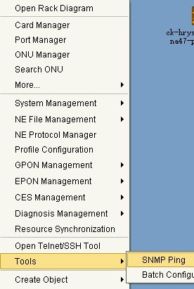

## Стандартна перевірка
##### Перегляд всіх ONU на порту
    show pon onu information gpon_olt-1/3/x
        1/3 - пишеться завжди, далі x - беремо з УС
            Звертаємо увагу на State:
                Working - порт піднятий
                LOS - порт лежить по фізиці
                DyingGasp - статус ОНУ означає, що вона на "на останньому подиху, щоб упасти" - перевіряти далі
##### Перегляд інформації по ONU 
    show gpon onu detail-info gpon_onu-1/3/1:1
    show pon onu information gpon_onu-1/3/1:1
    show gpon remote-onu interface eth gpon_onu_1/3/1:1 - перегляд швидкості на eth-порту ONU.
##### Перегляд МАС-адрес
    show mac dynamic - перегляд всіх маків
    show mac interface gpon_onu 1/3/1:2 -перегляд МАС'у по конкретній ОНУ
    show mac vlan 602 - перегляд МАС'у у влані
##### Перегляд логів. 
    show logging alarm 
##### Перезавантажити ОНУ
    configure terminal
    interface gpon_onu-1/3/1:39 
    reset
##### Адміністративно вимкнути/увімкнути ОНУ
    configure terminal
    interface gpon_onu-1/3/1:39 
    admin x
        , де х:
            disable - адміністративно закрити
            enable - адміністративно відкрити
##### Перегляд uptime, soft
    show software 

## Додатково
##### Перегляд оптичних показників
    show pon power olt-rx gpon_olt-1/3/7 - перегляд оптики по всьому порту 7
    show pon power attenuation gpon_onu-1/3/1:6 - перегляд оптики по ОНУ

    show optical-module-info xgei-1/1/1 - перегляд оптичних показників на UP-link інтерфейсі
###### Перегляд активної DHCP сесії
    show ip dhcp snooping dynamic database - перегляд всіх сесій
    show ip dhcp snooping dynamic ip - перегляд чи існує сесії по IP
    show ip dhcp snooping dynamic port vport-1/3/7.3:1 - ":1" додається просто до номеру ОНУ
###### Видалити мак на ОНУ та IP(DHCP сесію)
    configure terminal
    mac delete dynamic interface vport-1/3/7.3:1
    ip dhcp snooping clear interface vport-1/3/7.3:1 CA21.72EB.58BC vlan 1300

## Конфігурація
_Конфігурація відбувається через Систему Керування_
##### Прописати SNMP-параметри для OLT
    config t
        snmp-server community encrypted *31*RNZdUtVWwH0DwdHkKNpiXSjaYl0o2mJdKNpiXc3K22S1OuXGdwZNF063K66OQeFQ3zrjyoBtpsWxUsbgOagM1lf4VfF3fcZnaJI1ug== view AllView ro
        snmp-server community encrypted *31*RNZdUtVWwH0DwdHknw/IWZ8PyFmfD8hZnw/IWXk3OKtchzzXPmN3QZDtp4yv6TRscr9r16QLK4mKMkspy2CvXKAkmEwX+JBqwSbNqA== view AllView rw
        snmp-server version v2c enable
    exit
Заходимо в Систему Керування (OLT буде червоним)  
Необхідно натиснути ПКМ на OLT (котрий необхідно відновити)  
Обрати вкладку Tools -> SNMP Ping -> Start  
  
$\color{red}{\text{!!!Результат ping`у має бути вдалим}}$  
У лівому меню - > ПКМ по ОЛТ, який відновлюємо  
NE File Management -> Backup/Restore NE Configuration Data  
 

