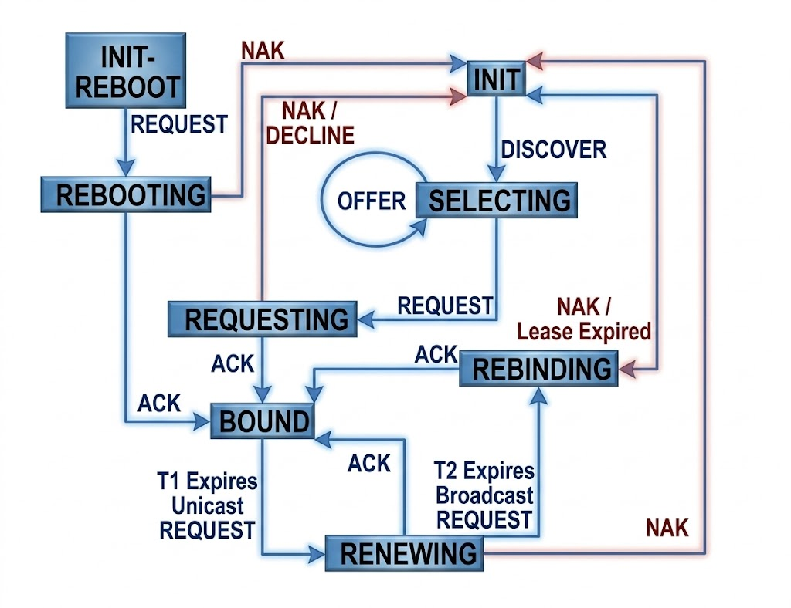

## Етапи DHCP

### Етапи DHCP

### Стани DHCP

### Довідник етапів отримання IP-адреси через DHCP (Процес DORA)

1. **DISCOVER (Виявлення):**
   * **Хто надсилає:** Клієнт → Усім (Broadcast).
   * **Суть:** "Я новенький у мережі, мені потрібна IP-адреса. Чи є тут DHCP-сервер?"

2. **OFFER (Пропозиція):**
   * **Хто надсилає:** Сервер(и) → Клієнту (Broadcast або Unicast).
   * **Суть:** "Привіт! Я DHCP-сервер. Можу запропонувати тобі ось цю вільну IP-адресу та базові налаштування мережі."

3. **REQUEST (Запит):**
   * **Хто надсилає:** Клієнт → Усім (Broadcast).
   * **Суть:** "Дякую! Я обираю саме твою пропозицію (вказує ID сервера). Будь ласка, закріпи цю IP-адресу за мною." (Надсилається усім, щоб інші сервери зрозуміли, що їхні пропозиції відхилено).

4. **ACK / ACKNOWLEDGMENT (Підтвердження):**
   * **Хто надсилає:** Обраний сервер → Клієнту.
   * **Суть:** "Домовилися! Адреса твоя на певний час (Lease time). Ось тобі також маска, шлюз та DNS. Можеш працювати."

##### Додаткові важливі повідомлення:
* **DECLINE (Відхилення):** Надсилається клієнтом серверу, якщо запропонована IP-адреса вже кимось використовується в мережі (виявляється за допомогою ARP-запиту).
* **RELEASE (Звільнення):** Надсилається клієнтом, коли він добровільно звільняє IP-адресу (наприклад, під час коректного вимкнення пристрою або команди ipconfig /release).

---

### Довідник станів DHCP (DHCP State Machine)

* **INIT (Ініціалізація):** Початковий стан. Клієнт не має IP-адреси і надсилає широкомовний запит DHCPDISCOVER для пошуку доступних DHCP-серверів.
* **SELECTING (Вибір):** Клієнт очікує на пропозиції від серверів (DHCPOFFER). Отримавши їх, він вибирає найкращу конфігурацію (зазвичай першу отриману).
* **REQUESTING (Запит):** Клієнт надсилає широкомовний запит DHCPREQUEST, у якому офіційно просить закріпити за ним вибрану IP-адресу. Інші сервери після цього звільняють свои резерви.
* **BOUND (Зв'язаний):** Клієнт отримує підтвердження DHCPACK, фіксує IP-адресу за собою та запускає таймери оренди (Lease time). Це стан нормальної роботи пристрою в мережі.
* **RENEWING (Оновлення оренди):** Настає автоматично, коли минає таймер T1 (зазвичай 50% часу оренди). Клієнт надсилає прямий (Unicast) запит DHCPREQUEST власнику-серверу, щоб продовжити час використання адреси.
* **REBINDING (Переприв'язка):** Настає, якщо сервер не відповів, і збіг таймер T2 (зазвичай 87.5% часу оренди). Клієнт починає надсилати широкомовні (Broadcast) запити DHCPREQUEST до будь-якого доступного DHCP-сервера в мережі, щоб зберегти поточну адресу.
* **INIT-REBOOT:** Стан, у якому перебуває пристрій одразу після перезавантаження, якщо він намагається знову використовувати свою попередню (ще не прострочену) IP-адресу.
* **REBOOTING:** Клієнт надсилає швидкий запит DHCPREQUEST, щоб перевірити, чи може він без повної процедури ініціалізації продовжувати роботу зі своєю старою IP-адресою у цій підмережі.

##### Ключові сигнали відмов на схемі:
* **NAK (Negative Acknowledgment):** Відмова сервера (наприклад, адреса вже зайнята або клієнт перемістився в іншу підмережу). Повертає клієнта в стан INIT або INIT-REBOOT.
* **Lease Expired:** Час оренди повністю вичерпано без відповіді від серверів — пристрій втрачає IP-адресу і повертається в стан INIT.
